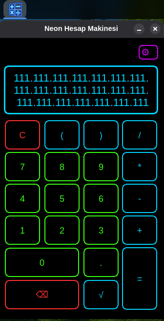
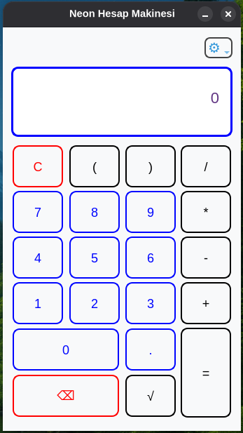
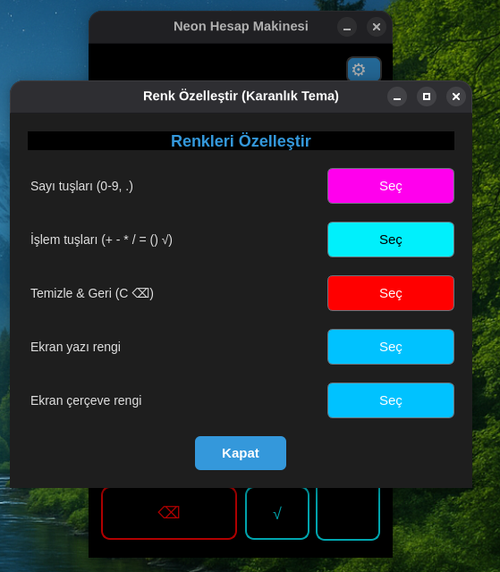
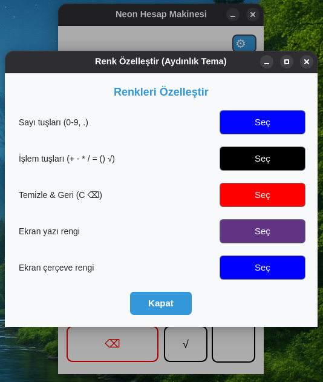
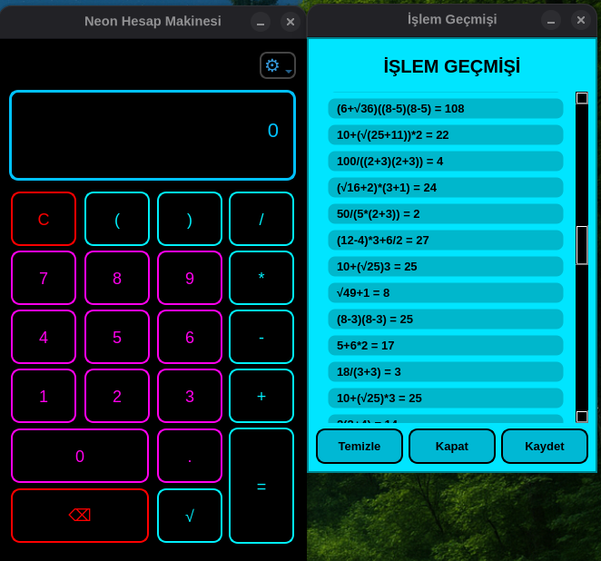

Neon Hesap Makinesi (Neon Calculator)

Modern, estetik ve yüksek hassasiyetli hesaplamalar için tasarlanmış, Python ve PyQt5 tabanlı bir masaüstü hesap makinesi uygulaması.

-------------------------------------------------------------------------------

Öne Çıkan Özellikler

* Yüksek Hassasiyetli Hesaplama: Standart hesap makinelerinin aksine, Decimal modülü sayesinde 15 ile 69 basamak arasında değişen aşırı yüksek hassasiyetle işlem yapabilme.

* Gelişmiş Karekök Desteği: İç içe geçmiş karekök ifadelerini ve parantezli karmaşık matematiksel yapıları doğru bir şekilde analiz edip çözebilen özel işlem motoru.

* Dinamik Neon Temalar: * Karanlık ve Aydınlık Mod: Göz yormayan karanlık mod veya temiz bir görünüm sunan aydınlık mod seçeneği.

* Renk Döngüsü: Renkleri Özelleştir seçeneği ile kullanıcı zevkine göre ayarlanabilir renk seçimi
  
* Akıllı İşlem Geçmişi: * Yapılan tüm işlemler yerel olarak kaydedilir.

* Geçmiş penceresinden eski işlemlere veya sonuçlara tek tıkla geri dönülebilir.

* İşlem geçmişini .txt dosyası olarak dışa aktarma imkanı.

* Klavye Desteği: Tam klavye entegrasyonu ile hızlı kullanım (Sayılar, Operatörler, Enter, Backspace, Esc).

-------------------------------------------------------------------------------

🛠 Teknik Detaylar

Dil: Python 3

Arayüz Kitaplığı: PyQt5

Hassasiyet Yönetimi: Python decimal kütüphanesi

Konfigürasyon: Kullanıcı tercihleri (tema, renk, hassasiyet) ~/.neon_calc_config dosyasında saklanır.

-------------------------------------------------------------------------------

Kurulum ve Çalıştırma

Uygulama çalışması için bağımlılık gerektirir . (python3-pyqt5)

Bağımlılık Kurulumu : sudo apt install python3-pyqt5 -y 

neon-paket.deb paketini çift tıklayıp kurulum yapabilirsiniz .

-------------------------------------------------------------------------------

Terminalden Kurulum .

neon-paket.deb paketini Masaüstü ne koyun

cd ~/Masaüstü

sudo dpkg -i neon-paket.deb

-------------------------------------------------------------------------------

Kısa Yollar

 Tuş                            İşlev 
0-9                         Sayı Girişi
"+ , - , * , /",            Operatörler
Enter / Return              Hesapla (=)
Backspace                 Son karakteri sil
Esc / Del                 Ekranı Temizle (C)
 
